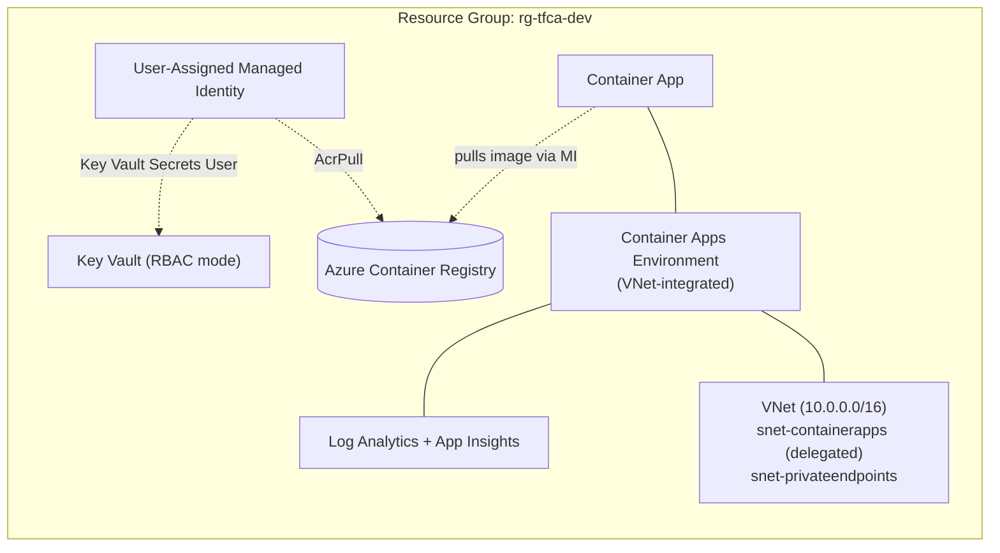
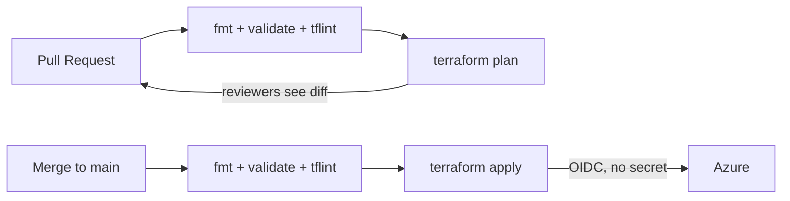

# Terraform Azure Container Apps Platform

Industry-grade **Infrastructure as Code** for a containerized application platform on Azure — built with modular **Terraform**, deployed through an **OIDC-secured GitHub Actions** pipeline, with **zero stored secrets** end to end.

This isn't a single-file demo. It's structured the way a real team runs Terraform: reusable modules, remote/locked state, isolated environments, automated quality gates, and managed-identity auth throughout.

---

## Architecture





---

## Tech stack

| Layer | Technology |
|---|---|
| IaC | Terraform (azurerm `~> 4.0`) |
| Compute | Azure Container Apps (VNet-integrated) |
| Registry | Azure Container Registry |
| Secrets | Azure Key Vault (RBAC authorization) |
| Networking | VNet + delegated / private-endpoint subnets |
| Observability | Log Analytics + Application Insights |
| Identity | User-assigned managed identity |
| State backend | Azure Storage (AAD auth, no keys) |
| CI/CD | GitHub Actions + OIDC (Workload Identity Federation) |
| Quality gates | terraform fmt, validate, TFLint (azurerm ruleset) |

---

## Repository structure

```
.
├── providers.tf                         # provider + partial backend config
├── main.tf                              # root: wires modules together
├── variables.tf                         # root inputs
├── outputs.tf
├── dev.tfvars / prod.tfvars             # per-environment values
├── backend-dev.hcl / backend-prod.hcl   # per-environment state keys
├── .tflint.hcl
├── .github/workflows/terraform.yml      # CI/CD pipeline
└── modules/
    ├── networking/         # VNet + subnets
    ├── monitoring/         # Log Analytics + App Insights
    ├── container_registry/ # ACR
    ├── key_vault/          # Key Vault (RBAC)
    ├── identity/           # managed identity + role assignments
    └── container_apps/     # environment + app
```

---

## Design principles

- **Secretless authentication everywhere.** GitHub Actions authenticates to Azure via OIDC (federated credentials) — no client secret stored. The Terraform state backend uses AAD auth (no storage key). The Container App pulls from ACR and reads Key Vault via a managed identity (no passwords).
- **Least privilege, by construction.** Each role assignment is scoped to exactly the resource it needs (`AcrPull` on the registry, `Key Vault Secrets User` on the vault), rather than blanket `Owner`.
- **Self-contained modules.** Every module declares its own `required_version` and `required_providers`, so it's portable into any project — version contracts travel with the code.
- **Plan before apply, always.** Pull requests run `terraform plan` so reviewers see the exact diff; `apply` only happens after merge.
- **Remote, locked, isolated state.** State lives in Azure Storage with locking; dev and prod use separate state keys so a dev change can never touch prod.
- **Quality gates enforce the bar.** `fmt`, `validate`, and `tflint` run on every change and block the pipeline on failure — infrastructure reviewed like application code.

---

## How it works

**Bootstrap (one-time, run by an Owner):**
1. Create the state storage account + container; grant the deployer `Storage Blob Data Contributor` (AAD-auth state, no keys).
2. Create an Entra app registration with federated credentials trusting this repo's `main` branch and pull requests.
3. Grant the CI service principal `Contributor` + `User Access Administrator` (it creates role assignments) and `Key Vault Secrets Officer`.

**Then, fully automated:**
- Open a PR -> pipeline runs the gates + `terraform plan`.
- Merge to `main` -> pipeline runs `terraform apply` via OIDC.

**Multi-environment:**
```bash
terraform init -backend-config=backend-dev.hcl  -reconfigure
terraform apply -var-file=dev.tfvars

terraform init -backend-config=backend-prod.hcl -reconfigure
terraform apply -var-file=prod.tfvars
```

---

## Challenges solved

The interesting engineering was in the failures, not the happy path:

- **Configuration drift** — Azure auto-added a default "Consumption" workload profile the code didn't declare; resolved by declaring it explicitly so desired state matches actual.
- **Deployer identity differs between local and CI** — a role assignment keyed off "current identity" churned every run (user locally, service principal in CI) and caused a chicken-and-egg 403. Fixed by treating the deployer's data-plane access as a bootstrap grant, not something Terraform self-manages.
- **Lint gate blocking dead code** — removing a resource orphaned its input variable; TFLint failed the build until it was cleaned up (the gate working as intended).
- **RBAC propagation timing** — data-plane role assignments need a moment to propagate before dependent resources can use them.

---

## Cleanup

```bash
terraform destroy -var-file=dev.tfvars
az group delete -n rg-terraform-state --yes --no-wait
```

---

## What this demonstrates

Modular IaC design, Terraform state management, multi-environment isolation, secretless cloud authentication (OIDC + managed identity), least-privilege RBAC, automated quality gates, and CI/CD for infrastructure — plus the real-world troubleshooting needed to make it all work together.